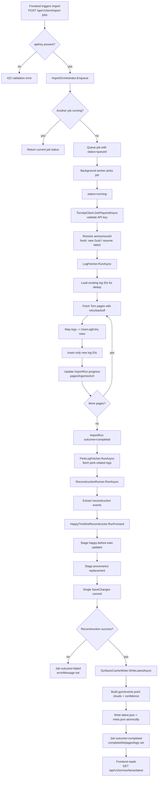

# HappyGymStats Business Logic & Reconstruction Flow

_Last updated: 2026-05-08_

This document captures the **current implemented flow** and identifies the safest insertion points for adding new logic/rules without breaking import, reconstruction, or surfaces output.

---

## 1) End-to-End Flow (Import → Reconstruction → Surfaces)



---

## 2) Reconstruction Internals

```mermaid
flowchart TD
    A[ReconstructionRunner.RunAsync] --> B{anonymousId provided?}
    B -- no --> C[Resolve from latest import run]
    B -- yes --> D[Use provided anonymousId]
    C --> E
    D --> E
    E{anonymousId found?}
    E -- no --> F[Return Success=false]
    E -- yes --> G[Load reconstruction records from DB]

    G --> H[LogEventExtractor.Extract]
    H --> I[GymTrain events]
    H --> J[MaxHappy events]
    H --> K[HappyDelta events]

    I --> L[HappyTimelineReconstructor.RunForward]
    J --> L
    K --> L

    L --> M[DerivedGymTrains + stats + warnings]
    M --> N[StageHappyBeforeTrainBatchAsync]
    N --> O[Load affiliation events]
    O --> P[Build personal/faction/company provenance rows]
    P --> Q[StageReplacementForPlayerAsync]
    Q --> R[UnitOfWork.SaveChangesAsync (atomic)]

    R --> S[Return Success=true + derived stats]
```

---

## 3) Current Guardrails/Rules Already in Code

1. **Single active import at a time** (orchestrator slot semaphore).
2. **Import dedup by `LogEntryId`** per anonymous player.
3. **Retry/backoff only for retryable Torn API failures**.
4. **Reconstruction DB writes committed atomically** in one `SaveChangesAsync`.
5. **Surfaces are file-cache based** (`latest.json`, `meta.json`) and served via API.
6. **Import job status lifecycle**: `queued` → `running` → `completed|failed|cancelled`.

---

## 4) Rule Insertion Map (Where to Add New Logic Safely)

This section maps practical extension points to concrete classes/methods.

## 4.1 Import Request / Job Admission Rules

**Where:**
- `src/HappyGymStats.Api/Controllers/ImportController.cs` (`StartImport`, `StartAnonymousImport`)
- `src/HappyGymStats.Core/Import/ImportOrchestrator.cs` (`Enqueue`)

**Use for:**
- API key policy checks
- Rate limits / cooldown
- mode rules (`fresh` vs `resume`)
- dedupe/ignore duplicate submission windows

**Keep in mind:**
- Reject at controller for request-shape/policy errors.
- Keep orchestrator admission logic deterministic.

---

## 4.2 Pre-Fetch Rules (before Torn page loop)

**Where:**
- `ImportOrchestrator.RunImportAsync` before `logFetcher.RunAsync`
- `LogFetcher.RunAsync` initialization block

**Use for:**
- player/account gating rules
- feature flags for fetch strategies
- run metadata initialization

**Keep in mind:**
- Must not leak secrets into logs.
- If rule fails, set clear `errorMessage` for operator diagnosis.

---

## 4.3 Fetch-Loop Rules (page-by-page)

**Where:**
- `LogFetcher.RunAsync` while loop
- `LogFetcher.FetchWithRetryAsync`
- `LogFetcher.MapUserLogEntry`

**Use for:**
- filter log types
- normalize/validate raw fields
- pagination stop criteria
- retry policy tuning

**Keep in mind:**
- Preserve idempotence and dedup semantics.
- Avoid hidden drops; count and log skipped rows if adding filters.

---

## 4.4 Event Extraction Rules

**Where:**
- `src/HappyGymStats.Core/Reconstruction/LogEventExtractor.cs`

**Use for:**
- mapping raw log records to reconstruction events
- introducing new event classes
- confidence/warning tagging inputs

**Keep in mind:**
- This is the seam between raw logs and reconstruction math.
- Prefer explicit unknown/unsupported event handling over silent ignore.

---

## 4.5 Reconstruction Math & Timeline Rules

**Where:**
- `src/HappyGymStats.Core/Reconstruction/HappyTimelineReconstructor.cs`
- `src/HappyGymStats.Core/Reconstruction/MaxHappyTimeline.cs`

**Use for:**
- happy-before/happy-after derivation updates
- clamp rules
- ordering/conflict policies
- warning generation for uncertain derivations

**Keep in mind:**
- Keep deterministic output for same input set.
- If changing formulas, version rationale should be documented.

---

## 4.6 Provenance Rules

**Where:**
- `ReconstructionRunner.BuildModifierProvenanceEntities`
- `src/HappyGymStats.Core/Reconstruction/ModifierOverrideLoader.cs`
- `SurfacesCacheWriter.ProjectProvenanceWarnings`

**Use for:**
- personal/faction/company verification status rules
- unresolved/unavailable classification
- manual override precedence

**Keep in mind:**
- This affects confidence display and warning surfaces.
- Keep status taxonomy stable: `verified|unresolved|unavailable`.

---

## 4.7 Surfaces Materialization Rules

**Where:**
- `src/HappyGymStats.Core/Surfaces/SurfacesCacheWriter.cs`
- `src/HappyGymStats.Core/Reconstruction/SurfaceSeriesBuilder.cs`

**Use for:**
- point cloud projection rules
- confidence scoring logic
- warning envelope structure
- metadata counters / diagnostics

**Keep in mind:**
- Preserve output contract expected by frontend (`series.gymCloud`, `version`, etc.).
- Writes are temp-file + move; keep atomicity.

---

## 4.8 API Surface Contract Rules

**Where:**
- `src/HappyGymStats.Api/Controllers/SurfacesController.cs`
- `src/HappyGymStats.Api/Controllers/GymTrainsController.cs`

**Use for:**
- envelope changes
- pagination/authorization policy
- fallback behavior when cache missing

**Keep in mind:**
- Contract changes should be additive when possible.
- If breaking, version endpoint or coordinate frontend release.

---

## 4.9 Post-Run Verification / Operational Rules

**Where:**
- `scripts/verify/s05-local-surfaces.sh`
- `scripts/verify/production-smoke.sh`

**Use for:**
- deploy-time checks for import→surfaces path
- route/service/health assertions
- regression guards for output shape

**Keep in mind:**
- These scripts are the quickest way to prove end-to-end integrity.

---

## 5) Recommended Change Workflow for New Rules

1. **Define rule scope first**: import, extraction, reconstruction, provenance, or surfaces.
2. **Add rule where data is most native** (avoid cross-layer hacks).
3. **Emit a clear warning/error state** when rule blocks or degrades output.
4. **Verify both DB path and surfaces contract** after changes.
5. **Update this doc** if flow/contract changes.

---

## 6) Minimal Verification Checklist After Logic Changes

Run these checks after any non-trivial rule update:

```bash
curl -sS https://torn.geromet.com/api/v1/torn/health | jq
```

```bash
curl -sS -X POST https://torn.geromet.com/api/v1/torn/import-jobs -H 'Content-Type: application/json' -d '{"apiKey":"<REDACTED>","fresh":false}' | jq
```

```bash
curl -sS https://torn.geromet.com/api/v1/torn/import-jobs/latest | jq
```

```bash
curl -sS https://torn.geromet.com/api/v1/torn/surfaces/latest | jq '.version, (.series.gymCloud|length)'
```

```bash
sudo journalctl -u happygymstats-api -n 200 --no-pager
```

---

## 7) Known Failure Signatures (for fast triage)

- `28P01 password authentication failed`: DB credential mismatch.
- `Format of the initialization string ...`: malformed connection string syntax.
- `502` on public endpoints + loopback down: backend crashloop or service down.
- `import outcome=failed` with Torn key validated first: failure is after key validation (usually DB/reconstruction path).

---

If we add new business rules, we should append a section per rule here with:
- objective
- insertion point(s)
- fallback behavior
- verification evidence

---

## 8) DB Schema-to-Flow Ownership Map (Table-by-Table)

This maps each logical stage to the DB tables it reads/writes, so rule changes can be localized safely.

> Notes:
> - Names below are based on observed production tables from restore output and runtime logs.
> - Treat this as an operational ownership map; verify exact columns with `\d <table>` before changing write logic.

## 8.1 Import Stage (Fetch + Run Tracking)

### `ImportRuns`
- **Owned by:** import stage (`LogFetcher`, orchestrator status coupling)
- **Written when:** import starts, each page progress update, and terminal state (`completed|failed|cancelled`)
- **Key fields used by flow:** started/completed timestamps, outcome, pages/logs fetched/appended, next cursor URL, error message
- **Read by:** resume logic (latest incomplete run), diagnostics/UI status

### `UserLogEntries`
- **Owned by:** fetch ingestion (`LogFetcher`)
- **Written when:** each fetched page is mapped and deduped by `LogEntryId`
- **Read by:** reconstruction event extraction
- **Rule impact risk:** high (any normalization/filtering here propagates to all downstream reconstruction)

### `LogTypes`
- **Owned by:** taxonomy/reference concerns (import-adjacent)
- **Read by:** extraction/reconstruction logic where log type semantics matter
- **Rule impact risk:** medium (wrong mapping can silently alter event classification)

---

## 8.2 Identity / Affiliation Context Stage

### `IdentityMap`
- **Owned by:** identity mapping + anonymous import path
- **Written when:** anonymous identity is created/updated (including encrypted identifiers where enabled)
- **Read by:** user-bound workflows and provenance context resolution

### `FactionIdMap`
- **Owned by:** affiliation identity resolution
- **Written when:** faction ID correspondence is learned/refined
- **Read by:** provenance linking and diagnostics

### `FactionMembership`
- **Owned by:** affiliation timeline ingestion
- **Read by:** provenance classification for faction context at event time

### `AffiliationEvents`
- **Owned by:** affiliation event timeline
- **Read by:** `ReconstructionRunner.BuildModifierProvenanceEntities`
- **Rule impact risk:** high for confidence/provenance behavior

---

## 8.3 Reconstruction Stage (Derived Outputs)

### `DerivedGymTrains`
- **Owned by:** reconstruction core (`HappyTimelineReconstructor` output projection)
- **Written when:** reconstruction commits staged updates
- **Read by:** surfaces projection (`gymCloud`) and trains APIs
- **Rule impact risk:** very high (primary business artifact)

### `ModifierProvenance`
- **Owned by:** reconstruction provenance builder + override projection layer
- **Written when:** per-player replacement staging/commit during reconstruction
- **Read by:** surfaces warning/confidence projection
- **Rule impact risk:** high (user-facing confidence/warning semantics)

### `DerivedHappyEvents` (if populated in current run mode)
- **Owned by:** reconstruction-derived event pipeline
- **Read by:** secondary analytics/surfaces depending on feature usage
- **Rule impact risk:** medium

---

## 8.4 API/Surface Materialization Stage

### `ModifierProvenance` + gym log source set
- **Read by:** `SurfacesCacheWriter` to build confidence reasons and unresolved warning projection

### `latest.json` / `meta.json` (file cache, not DB)
- **Owned by:** surfaces writer (atomic temp-write + move)
- **Served by:** `SurfacesController`
- **Important:** frontend freshness depends on these files even when DB is correct

---

## 8.5 Change-Safety Matrix (Quick Reference)

- **Import-only rule change:** usually touches `ImportRuns`, `UserLogEntries`
- **Event classification rule change:** usually touches interpretation of `UserLogEntries` + `LogTypes`
- **Reconstruction math rule change:** primarily affects `DerivedGymTrains` (+ optionally `DerivedHappyEvents`)
- **Confidence/provenance rule change:** primarily affects `ModifierProvenance`, `AffiliationEvents`, `FactionMembership`
- **Frontend freshness issue:** check surfaces cache files and `version` in `latest.json`, not just DB rows

---

## 8.6 Minimal DB Inspection Commands (Server)

```bash
sudo docker exec -it containers-postgres-1 psql -U happygym -d happygymstats -c '\dt'
```

```bash
sudo docker exec -it containers-postgres-1 psql -U happygym -d happygymstats -c '\d "ImportRuns"'
```

```bash
sudo docker exec -it containers-postgres-1 psql -U happygym -d happygymstats -c 'select id,outcome,started_at_utc,completed_at_utc,pages_fetched,logs_fetched,logs_appended,error_message from "ImportRuns" order by started_at_utc desc limit 20;'
```

```bash
sudo docker exec -it containers-postgres-1 psql -U happygym -d happygymstats -c 'select count(*) as derived_trains from "DerivedGymTrains";'
```

---

## 9) Proposed New Rules Template (Use This for Every New Rule)

Use one row per proposed rule before implementation. Keep it short and concrete.

| Rule ID | Stage | Trigger / Condition | Action (What changes) | Data/Tables touched | Insertion point (file + method) | Fallback / Failure behavior | Observability signal | Verification command(s) | Status |
|---|---|---|---|---|---|---|---|---|---|
| R-001 | Reconstruction | e.g. `log_type_id in (...)` and missing happy_before | e.g. infer happy_before using previous event + clamp | `UserLogEntries`, `DerivedGymTrains` | `src/HappyGymStats.Core/Reconstruction/HappyTimelineReconstructor.cs` `RunForward` | mark warning + continue, never hard-fail import | warning count increment + structured log line | `curl .../import-jobs/latest`, `curl .../surfaces/latest` | Draft |
| R-002 | Provenance | e.g. unresolved faction and manual override exists | apply override target for warning projection | `ModifierProvenance`, override file | `src/HappyGymStats.Core/Surfaces/SurfacesCacheWriter.cs` `ProjectProvenanceWarnings` | keep unresolved target when override invalid | `provenanceWarningsDiagnostics` fields in `latest.json` | `curl .../surfaces/latest | jq '.meta.provenanceWarningsDiagnostics'` | Draft |

### 9.1 Rule Definition Card (Copy/Paste)

Use this block when a rule needs more than one table row of explanation.

```md
### Rule <RULE_ID>: <Short name>

- **Goal:**
- **Business reason:**
- **Stage:** Import | Extraction | Reconstruction | Provenance | Surfaces | API
- **Trigger / Condition:**
- **Action:**
- **Primary insertion point(s):**
  - `path/to/file.cs` → `MethodName(...)`
- **Data touched:**
  - Reads:
  - Writes:
- **Failure policy:** fail-closed | fail-open + warning
- **Observability additions:**
  - Logs:
  - Counters/diagnostics:
- **Verification evidence required:**
  - Command(s):
  - Expected result:
- **Rollout strategy:** dark-launch | immediate | flag-gated
- **Backout plan:**
```

### 9.2 Status Vocabulary

Use these status values in the table:
- `Draft` — idea captured, not implemented
- `Planned` — implementation approach agreed
- `In Progress` — code changes underway
- `Verified` — behavior proven with evidence
- `Deferred` — intentionally postponed
- `Rejected` — considered, not adopted

### 9.3 Rule Review Gate (Before Merge/Deploy)

A rule is ready only when all are true:
- insertion point is explicit (file + method)
- fallback behavior is defined
- at least one observability signal exists
- at least one verification command has expected output documented
- impact on surfaces contract is stated (`none` / `additive` / `breaking`)

